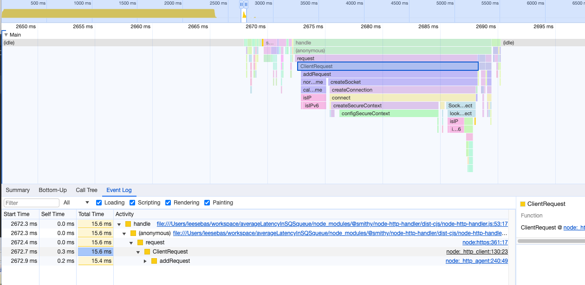
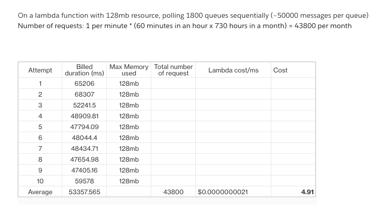
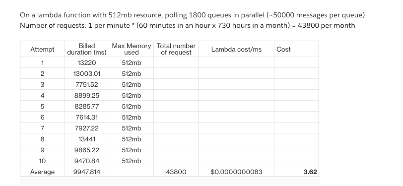
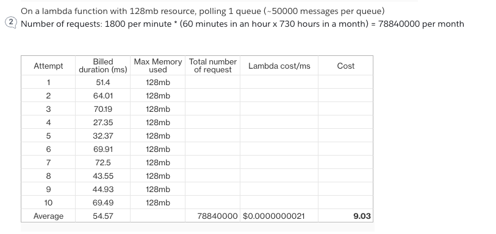

# Objective

1. Calculate the average/P90 latency to get an approximate number of messages per queue using the API, GetQueueAttributesCommand

# Setup

1. 1800 standard SQS queues
2. ~50,000 messages per queue
3. AWS lambda

NOTE: This setup is done in a controlled environment and may not reflect actual production scenario

# Results

### Experiment 1
On a lambda function with 512mb resource, polling 1800 queues sequentially (~50000 messages per queue)
Number of requests made: 1 per minute * (60 minutes in an hour x 730 hours in a month) = 43800 per month
**Result: On average, the request takes ~17094 ms, total cost ~$6.21**


### Experiment 2
On a lambda function with 128mb resource, polling 1800 queues sequentially (~50000 messages per queue)
Number of requests made: 1 per minute * (60 minutes in an hour x 730 hours in a month) = 43800 per month
**Result: On average, the request takes ~52666 ms, total cost ~$4.84**


### Experiment 3
On a lambda function with 512mb resource, polling 1800 queues in parallel (~50000 messages per queue)
Number of requests made: 1 per minute * (60 minutes in an hour x 730 hours in a month) = 43800 per month
**Result: On average, the request takes ~9947 ms, total cost ~$3.62**


### Experiment 4
On a lambda function with 128mb resource, polling 1 queue (~50000 messages per queue)
Number of requests made: 1800 per minute * (60 minutes in an hour x 730 hours in a month) = 78840000 per month
**Result: On average, the request takes ~54 ms, total cost ~$9.03**


# Screenshots

Flamegraph 



Experiment 1


Experiment 2


Experiment 3


Experiment 4



# FAQ

## How many queues were used during the experiment?

```
aws cloudformation describe-stacks | jq '.Stacks[].Outputs[] | select(.OutputKey | startswith("latencyQueueCdkQueueStack")) | .OutputValue' | wc -l
> 1800

```

## How many messages were used per queue?

> 50,000 messages per queue